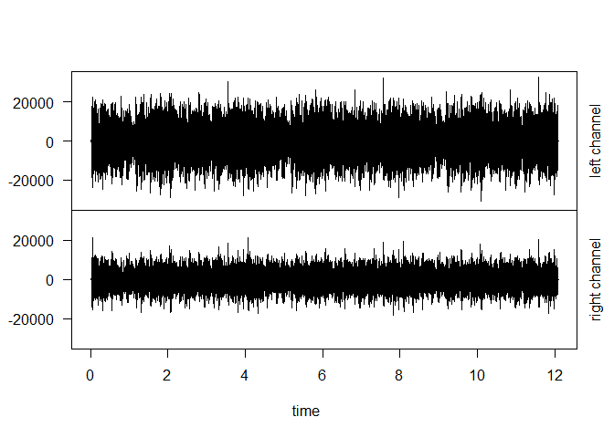
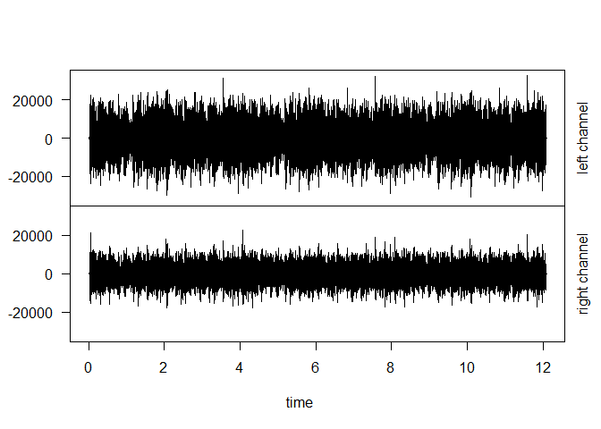
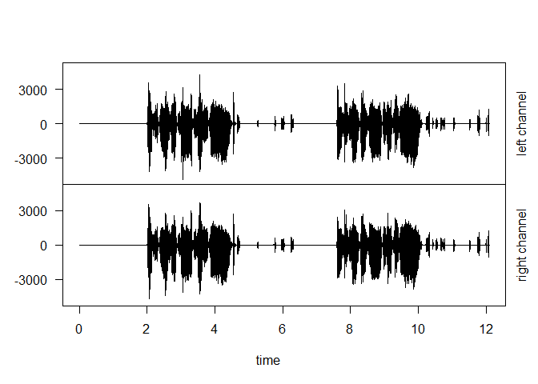

OurSong puzzle game
================

##### 宇宙的漣漪 解謎遊戲 2021

*答案來自厲害的網友*

###### Day1

> 第一關：Omniscient Coin (Vibe)/ 第一個NFT/ 42專輯某一首歌。 找出
> 處女秀Live版中 1:00 的歌詞 & 典故出自哪部電影

-   [知的所有](https://youtu.be/7z_MWnF7LFY) **我恐怕不能麼做**
-   **太空漫遊 2001HAL9000**

> 第二關 找出密語

-   audio source
    [OmniscientCoin.mp4](https://pochang.com/videos/OmniscientCoin.mp4)
-   package source [Spectrograms in R using the ‘av’
    package](https://docs.ropensci.org/av/articles/articles/spectrograms.html)

``` r
# install.packages("av")
library(av)
# Read file
fft_data <- read_audio_fft("D:/Downloads/OmniscientCoin.mp4")
```

###### Plot

可以看到解密後的字 **vuingtm.kzn**

``` r
plot(fft_data)
```

<!-- -->

###### 音檔解析

``` r
# install.packages("tuneR")
library(tuneR)
```

    ## 
    ## Attaching package: 'tuneR'

    ## The following object is masked from 'package:av':
    ## 
    ##     sine

``` r
mp4file <- readMP3("D:/Downloads/OmniscientCoin.mp4")
str(mp4file)
```

    ## Formal class 'Wave' [package "tuneR"] with 6 slots
    ##   ..@ left     : int [1:26112] 0 1 -2 1 1 0 -3 2 3 -1 ...
    ##   ..@ right    : int [1:26112] 0 0 -2 1 1 1 -2 2 -1 0 ...
    ##   ..@ stereo   : logi TRUE
    ##   ..@ samp.rate: num 44100
    ##   ..@ bit      : num 16
    ##   ..@ pcm      : logi TRUE

###### Day2

> 暖身: 42專輯封面上天使名字，其兩手拿著什麼

**圖靈，Veronica汗巾**

> 第三關 解密 vuingtm.kzn

[Conquer
Vibe](https://opensea.io/assets/0xa42bd534270dd4c934d970429392ce335c79220d/1277/)
圖片正面，凱撒密碼(偏移量6)

**pochang.eth**

###### Day3

> 暖身: [虛擬展間](https://oncyber.io/pochang.eth)
> 其中2個作品來自同個作家的2本書籍，該作家 & 作品名稱為何 ?

-   **100%U/ 1984**
-   **喬治歐威爾 動物農莊/ 1984**

> 第四關 用2個音檔解出一個字串 (Hint: 用聽的/ Coin Flipping)

**Audiacity 將其中一隔音軌 效果 =&gt; 倒轉(上下) 兩個音訊互相抵銷**

``` r
audio1 <- readMP3("D:/Downloads/conquer1.mp3")
str(audio1)
```

    ## Formal class 'Wave' [package "tuneR"] with 6 slots
    ##   ..@ left     : int [1:533376] 0 0 0 0 0 0 0 0 0 0 ...
    ##   ..@ right    : int [1:533376] 0 0 0 0 0 0 0 0 0 0 ...
    ##   ..@ stereo   : logi TRUE
    ##   ..@ samp.rate: num 44100
    ##   ..@ bit      : num 16
    ##   ..@ pcm      : logi TRUE

``` r
tuneR::plot(audio1)
```

<!-- -->

``` r
audio1Left <- audio1@left
audio1Right <- audio1@right

audio2 <- readMP3("D:/Downloads/conquer2.mp3")
str(audio2)
```

    ## Formal class 'Wave' [package "tuneR"] with 6 slots
    ##   ..@ left     : int [1:533376] 0 0 0 0 0 0 0 0 0 0 ...
    ##   ..@ right    : int [1:533376] 0 0 0 0 0 0 0 0 0 0 ...
    ##   ..@ stereo   : logi TRUE
    ##   ..@ samp.rate: num 44100
    ##   ..@ bit      : num 16
    ##   ..@ pcm      : logi TRUE

``` r
tuneR::plot(audio2)
```

<!-- -->

``` r
audio2Left <- audio2@left
audio2Right <- audio2@right

# audio2 聲音相位反轉Phase invert
outputaudio <- Wave(left = audio1Left + (-audio2Left) , 
                    right = audio1Right + (-audio2Right), 
                    samp.rate = 44100, bit = 16, pcm = TRUE)
str(outputaudio)
```

    ## Formal class 'Wave' [package "tuneR"] with 6 slots
    ##   ..@ left     : int [1:533376] 0 0 0 0 0 0 0 0 0 0 ...
    ##   ..@ right    : int [1:533376] 0 0 0 0 0 0 0 0 0 0 ...
    ##   ..@ stereo   : logi TRUE
    ##   ..@ samp.rate: num 44100
    ##   ..@ bit      : num 16
    ##   ..@ pcm      : logi TRUE

``` r
tuneR::plot(outputaudio)
```

<!-- -->

``` r
#  write 
tdir <- getwd()
tfile <- file.path(tdir, "puzzle.wav")
tuneR::writeWave(outputaudio, filename = tfile)
```


答案在音檔中 ***XJBKXXXVL***

###### Day4

> 暖身: pochang作詞的作品有出現**宇宙**的3首歌曲 & YT連結

-   [知的所有](https://youtu.be/7z_MWnF7LFY)
-   [天馬神風](https://youtu.be/tbyM-OEs30E)
-   [別來](https://youtu.be/VAY_Bw_2rbE)

> 第四關 利用密鑰解開密文(密鑰提示:在宇宙的尺度裡We are
> \_\_\_\_\_\_\_\_，8個字母的英文單字) **stardust**

-   LBMV WLSOWELVUM
-   ***STAR DUSTSTATDU***

[用維吉尼亞密碼解密](https://en.wikipedia.org/wiki/Vigen%C3%A8re_cipher)
- **TIME TRAVELLERS**
