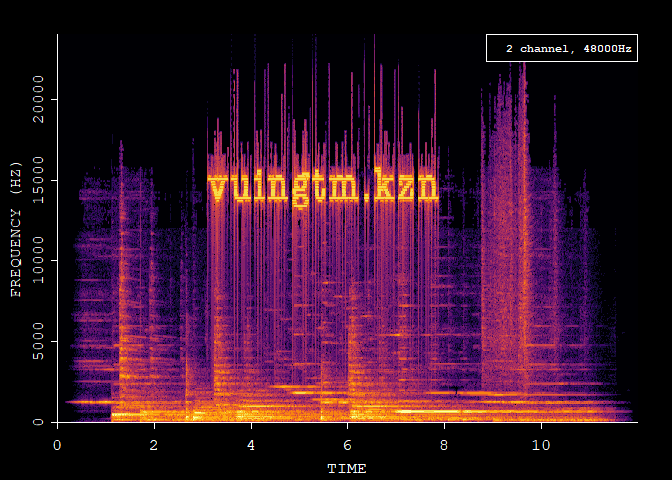

OurSong puzzle game
================

#### 宇宙的漣漪 第二關

##### audio source [OmniscientCoin.mp4](https://pochang.com/videos/OmniscientCoin.mp4)

##### package source [Spectrograms in R using the ‘av’ package](https://docs.ropensci.org/av/articles/articles/spectrograms.html)

``` r
# install.packages("av")
library(av)
```

    ## Warning: package 'av' was built under R version 4.0.5

``` r
# Read file
fft_data <- read_audio_fft("D:/Downloads/OmniscientCoin.mp4")
```

##### Plot

可以看到解密後的 vuingtm.kzn

``` r
plot(fft_data)
```

<!-- -->

###### 音檔解析

``` r
library(tuneR)
```

    ## Warning: package 'tuneR' was built under R version 4.0.5

    ## 
    ## Attaching package: 'tuneR'

    ## The following object is masked from 'package:av':
    ## 
    ##     sine

``` r
mp4file <- readMP3("D:/Downloads/OmniscientCoin.mp4")
str(mp4file)
```

    ## Formal class 'Wave' [package "tuneR"] with 6 slots
    ##   ..@ left     : int [1:26112] 0 1 -2 1 1 0 -3 2 3 -1 ...
    ##   ..@ right    : int [1:26112] 0 0 -2 1 1 1 -2 2 -1 0 ...
    ##   ..@ stereo   : logi TRUE
    ##   ..@ samp.rate: num 44100
    ##   ..@ bit      : num 16
    ##   ..@ pcm      : logi TRUE
